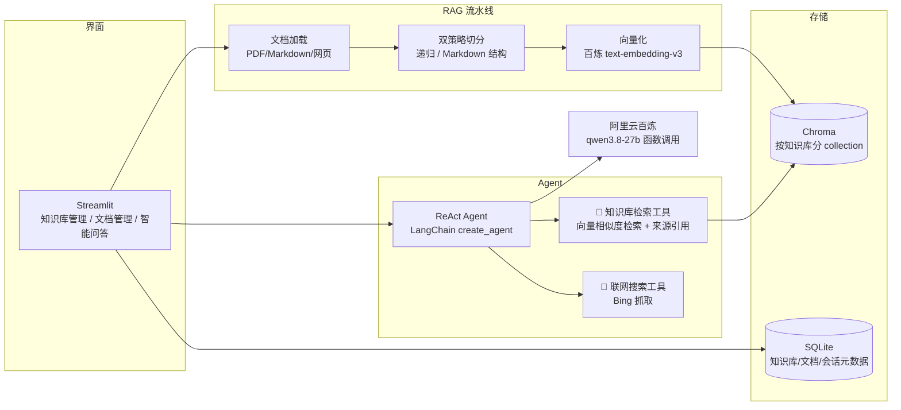

# 个人知识库 AI 问答工具（RAG + Agent）

基于 **Streamlit + LangChain + 阿里云百炼** 的个人知识库问答工具：导入 PDF / Markdown / 网页构建知识库，智能问答支持本地知识库检索与联网搜索，**Agent 自主决策用哪个工具**，思考过程可视化展示。

> 本项目使用 VSCode + Claude Code（DeepSeek）AI 辅助开发，从需求梳理到部署全程 AI 协作完成。

## ✨ 功能特性

| 功能 | 说明 |
|------|------|
| 📥 三种导入方式 | PDF（逐页解析）/ Markdown（按标题结构切分）/ 网页（URL 抓取正文） |
| ✂️ 双切分策略 | 递归字符切分（无结构文本）+ Markdown 标题结构切分，按文档类型自动选择 |
| 🔍 向量检索 + 来源引用 | 相似度检索（余弦空间），展示来源文件名 + 页码 + 相似度分数 |
| 🤖 Agent 自主决策 | LangChain ReAct Agent：模型自己决定用「知识库检索」还是「联网搜索」 |
| 🔎 联网搜索 | Bing 抓取（国内可达），知识库没有的时效性信息自动联网查 |
| 👁 思考过程可视化 | 界面可展开查看 Agent 的工具调用链（调了什么工具、参数、返回） |
| 🗂 多知识库管理 | 各知识库向量数据独立隔离（独立 collection），可建可删 |
| 💾 会话持久化 | SQLite 保存会话与消息，刷新页面后历史可恢复 |

## 🏗 系统架构



### 核心设计：RAG 之上加 Agent

```
用户提问
   │
   ▼
ReAct 循环：思考 → 行动 → 观察
   │
   ├─ 问题涉及已导入文档 → 调用 search_knowledge_base（本地向量检索）
   ├─ 需要时效性信息       → 调用 web_search（Bing 联网搜索）
   └─ 工具都找不到         → 诚实回答"没有找到相关资料"
   │
   ▼
界面展示：最终回答 + 可展开的工具调用链（每步工具名/参数/返回）
```

## 🛠 技术栈

| 层 | 技术 | 选型理由 |
|----|------|---------|
| 界面 | Streamlit | 纯 Python 快速搭建交互界面，数据应用标配 |
| Agent | LangChain 1.x create_agent | ReAct 循环编排 + 工具协议标准化 |
| 大模型 | 阿里云百炼 qwen3.8-27b（支持函数调用） | OpenAI 兼容接口，函数调用能力是 Agent 的前提 |
| 向量化 | text-embedding-v3（自定义 Embeddings 类） | 百炼接口与 langchain-openai 的兼容问题需自定义适配 |
| 向量库 | Chroma（持久化，按知识库分 collection） | 嵌入式部署零运维，个人场景足够 |
| 元数据 | SQLite | 单用户本地工具，零运维；与向量库各司其职 |
| 解析 | pypdf + BeautifulSoup | PDF 逐页提取；网页正文提取（去导航/脚本噪音） |

## 🚀 快速开始

### 前置条件

- Python 3.11+（本项目在 3.13 验证）
- 阿里云百炼 API Key（[申请地址](https://bailian.console.aliyun.com/)）

### 安装与启动

```bash
# 1. 安装依赖
python -m venv .venv
.venv/Scripts/pip install -r requirements.txt    # Windows
# source .venv/bin/pip install -r requirements.txt  # Mac/Linux

# 2. 配置环境变量
cp .env.example .env
# 编辑 .env，填入 DASHSCOPE_API_KEY

# 3. 启动
.venv/Scripts/streamlit run main.py    # 自动打开浏览器 http://localhost:8501
```

### 使用流程

1. 左侧「新建知识库」→ 输入名称（如：学习资料）
2. 「文档管理」页：上传 PDF/Markdown，或粘贴网页 URL 导入
3. 「智能问答」页提问：
   - 问知识库里的内容 → Agent 自动检索本地知识库（带来源引用）
   - 问时效性问题（新闻/天气）→ Agent 自动联网搜索
4. 展开「🔍 查看 Agent 思考过程」观察工具调用链

### 运行测试

```bash
.venv/Scripts/python -m pytest tests/ -v    # 16 个用例，全 mock 外部服务
```

## 📁 项目结构

```
project3/
├── main.py                  # Streamlit 入口（界面编排）
├── app/
│   ├── config.py            # 配置（.env 入口 + 数据目录）
│   ├── db.py                # SQLite 元数据（知识库/文档/会话/消息）
│   ├── embeddings.py        # 百炼自定义 Embeddings（接口兼容适配）
│   ├── loader.py            # PDF/Markdown/网页加载
│   ├── splitter.py          # 双策略切分（递归 / Markdown 结构）
│   ├── vectorstore.py       # Chroma 封装（余弦空间 + 相似度转换）
│   └── agent.py             # ReAct Agent + 两个工具 + 调用链记录
├── tests/                   # pytest（16 用例，全 mock）
├── requirements.txt
└── .env.example
```

## ⚠️ 已知限制

- PDF 暂不支持扫描件（需要 OCR，可用外部工具预处理）
- 网页导入对需要登录/纯 JS 渲染的页面无效
- 联网搜索基于 Bing 结果页抓取，站点结构变化可能需要适配
- 单用户本地工具定位，未做多用户隔离与登录
